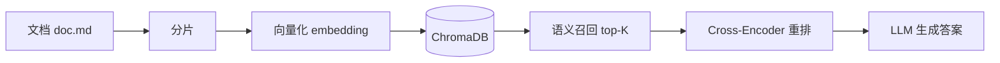

# RAG

基于 Python 的检索增强生成（Retrieval-Augmented Generation）项目，包含 RAG 完整流程、余弦相似度原理演示以及 LangChain 聊天模型接入示例。

## 项目结构

```
.
├── ragdemo/
│   ├── rag-demo.py            # RAG 主流程：索引 → 召回 → 重排 → 生成
│   └── doc.md                 # 示例文档（用于索引和检索）
├── cosine-similarity/
│   └── cosine-similarity.py   # 余弦相似度原理演示
├── langchain/
│   └── chat-openai-demo.py    # LangChain ChatOpenAI 聊天模型接入示例
├── pyproject.toml             # 项目依赖与配置
└── .env                       # API 密钥与 Base URL（需自行创建）
```

## 技术栈

| 组件 | 选型 |
|------|------|
| 嵌入模型 | [BAAI/bge-base-en-v1.5](https://huggingface.co/BAAI/bge-base-en-v1.5)（768 维） |
| 重排模型 | [BAAI/bge-reranker-base](https://huggingface.co/BAAI/bge-reranker-base) |
| 向量数据库 | [ChromaDB](https://www.trychroma.com/)（内存模式） |
| LLM | qwen3.6-plus（阿里云百炼 OpenAI 兼容接口） |
| LLM 框架 | [LangChain](https://www.langchain.com/)（ChatOpenAI） |
| 包管理 | [uv](https://docs.astral.sh/uv/) |

## 快速开始

### 前置条件

- Python >= 3.14
- [uv](https://docs.astral.sh/uv/getting-started/installation/)

### 安装

```bash
git clone https://github.com/Xiaolei5035/python-rag.git
cd python-demo
uv sync
```

### 配置

在项目根目录创建 `.env` 文件：

```env
OPENAI_API_KEY=your-api-key
BASE_URL=https://dashscope.aliyuncs.com/compatible-mode/v1
```

> 本项目通过 OpenAI 兼容协议接入 LLM，支持阿里云百炼、DashScope 等服务。

### 运行

```bash
uv run demo-demo/demo-demo.py          # RAG 完整流程
uv run cosine-similarity/cosine-similarity.py  # 余弦相似度演示
uv run demo/llm-models.py           # LangChain 聊天模型
```

## RAG 流程



| 阶段 | 说明 |
|------|------|
| 分片 | 按双换行符将文档切分为多个 chunk |
| 向量化 | 使用 BGE 模型将每个 chunk 编码为 768 维向量 |
| 索引 | 向量及原文存入 ChromaDB（内存模式） |
| 召回 | 查询时通过向量相似度检索 Top-10 候选段落 |
| 重排 | Cross-Encoder 对召回结果重新打分，取 Top-3 |
| 生成 | 将重排后的上下文传入 LLM，生成最终答案 |

## 余弦相似度

`cosine-similarity.py` 从零实现了余弦相似度计算，展示向量检索的核心数学原理：

```
similarity = dot(A, B) / (norm(A) × norm(B))
```

## LangChain 聊天模型

`chat-openai-demo.py` 演示了 ChatOpenAI 的三种调用方式：

- **简单调用** `model.invoke()` — 一次性问答
- **流式输出** `model.stream()` — 打字机效果
- **多轮对话** — 使用 `SystemMessage` / `HumanMessage` 构建消息列表
