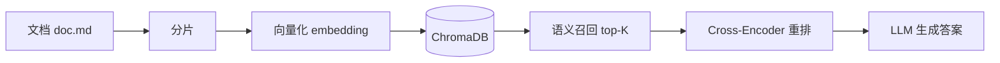

# LangChain Demo

基于 LangChain 的 Python 学习项目，包含 RAG（检索增强生成）、LLM 聊天模型、嵌入模型及余弦相似度原理演示。

## 项目结构

```
.
├── demo/
│   ├── llm-models.py                    # ChatOpenAI 聊天模型：简单调用 / 流式输出 / 多轮对话
│   ├── embedding-models.py              # HuggingFace 嵌入模型 + 余弦相似度检索
│   ├── universal-prompt.py              # 通用提示词模板（zero-shot + LCEL 链式调用）
│   ├── fewshot-prompt.py                # 样本提示词模板（few-shot）
│   ├── chat-prompt.py                   # 聊天提示词模板（ChatPromptTemplate + 历史会话）
│   └── rag/
│       ├── rag.py                       # RAG 完整流程：索引 → 召回 → 重排 → 生成
│       ├── cosine-similarity/
│       │   └── cosine-similarity.py     # 余弦相似度从零实现
│       └── doc.md                       # 示例文档（用于 RAG 索引和检索）
├── pyproject.toml                       # 项目依赖与配置
├── uv.lock
└── .env                                 # API 密钥与 Base URL（需自行创建）
```

## 技术栈

| 组件 | 选型 |
|------|------|
| 嵌入模型 | [BAAI/bge-base-zh-v1.5](https://huggingface.co/BAAI/bge-base-zh-v1.5)（768 维） |
| 重排模型 | [BAAI/bge-reranker-base](https://huggingface.co/BAAI/bge-reranker-base) |
| 向量数据库 | [ChromaDB](https://www.trychroma.com/)（内存模式） |
| LLM | qwen3.6-plus（阿里云百炼 OpenAI 兼容接口） |
| LLM 框架 | [LangChain](https://www.langchain.com/)（ChatOpenAI） |
| 嵌入框架 | [LangChain-HuggingFace](https://python.langchain.com/docs/integrations/text_embedding/huggingface/) |
| 包管理 | [uv](https://docs.astral.sh/uv/) |

## 快速开始

### 前置条件

- Python >= 3.14
- [uv](https://docs.astral.sh/uv/getting-started/installation/)

### 安装

```bash
git clone https://github.com/XiaoLeiBro/langchain-demo.git
cd langchain-demo
uv sync
```

### 配置

在项目根目录创建 `.env` 文件：

```env
OPENAI_API_KEY=your-api-key
BASE_URL=https://dashscope.aliyuncs.com/compatible-mode/v1
```

> 本项目通过 OpenAI 兼容协议接入 LLM，支持阿里云百炼、DashScope 等服务。

### 运行

```bash
uv run demo/universal-prompt.py                           # 通用提示词模板（LCEL 链式调用）
uv run demo/fewshot-prompt.py                            # 样本提示词模板（few-shot）
uv run demo/chat-prompt.py                               # 聊天提示词模板（ChatPromptTemplate + 历史会话）
uv run demo/llm-models.py                              # LangChain 聊天模型
uv run demo/embedding-models.py                         # 嵌入模型 + 余弦相似度检索
uv run demo/rag/rag.py                                  # RAG 完整流程
uv run demo/rag/cosine-similarity/cosine-similarity.py  # 余弦相似度原理演示
```

## RAG 流程



| 阶段 | 说明 |
|------|------|
| 分片 | 按双换行符将文档切分为多个 chunk |
| 向量化 | 使用 BGE 模型将每个 chunk 编码为 768 维向量 |
| 索引 | 向量及原文存入 ChromaDB（内存模式） |
| 召回 | 查询时通过向量相似度检索 Top-10 候选段落 |
| 重排 | Cross-Encoder 对召回结果重新打分，取 Top-3 |
| 生成 | 将重排后的上下文传入 LLM，生成最终答案 |

## 嵌入模型

`demo/embedding-models.py` 使用 HuggingFaceEmbeddings 加载 BGE 中文模型，演示文本向量化与余弦相似度检索。

## 余弦相似度

`demo/rag/cosine-similarity/cosine-similarity.py` 从零实现了余弦相似度计算，展示向量检索的核心数学原理：

```
similarity = dot(A, B) / (norm(A) × norm(B))
```

## 提示词模板与链式调用

`demo/universal-prompt.py` 演示了 PromptTemplate 与 LCEL（LangChain Expression Language）链式调用：

- **PromptTemplate** — 使用 `{变量}` 占位符定义可复用的提示词模板，通过 `.format()` 注入参数
- **LCEL 链式调用** — 使用 `|` 管道符将 prompt 与 model 串联为链（chain），`chain.invoke()` 一次完成格式化+推理

```python
# 链式调用：prompt | model，一次调用完成格式化 + LLM 推理
chain = prompt_template | model
res = chain.invoke(input={"poet": "王维", "story": "唐诗"})
```

## 样本提示词模板（Few-Shot）

`demo/fewshot-prompt.py` 演示了 FewShotPromptTemplate 的用法，通过提供示例让 LLM 理解任务模式：

- **example_prompt** — 定义每个样本的格式模板
- **examples** — 注入样本数据（list 内套 dict）
- **prefix / suffix** — 拼接提示词的前缀和后缀，`input_variables` 声明动态变量

```python
few_shot_prompt_template = FewShotPromptTemplate(
    example_prompt=example_prompt,
    examples=[{"word": "大", "antonym": "小"}, ...],
    prefix="告诉我单词的反义词，我提供如下的示例：",
    suffix="基于前面的示例告诉我：{input_word}的反义词是？",
    input_variables=["input_word"],
)
```

## 聊天提示词模板（ChatPromptTemplate）

`demo/chat-prompt.py` 演示了 ChatPromptTemplate 的用法，通过 `MessagesPlaceholder` 植入任意数量的历史会话信息：

- **from_messages** — 使用消息列表构建聊天提示词模板，支持 `system`、`human`、`ai` 等角色
- **MessagesPlaceholder** — 声明一个可注入历史消息列表的占位符
- **invoke + to_string** — 将历史数据注入模板后，转为可传入 LLM 的纯文本

```python
chat_prompt_template = ChatPromptTemplate.from_messages([
    ("system", "你是一个AI助理。"),
    MessagesPlaceholder("history"),
    ("human", "向量数据库中，向量相似度的算法都有哪些？"),
])

history_data = [
    ("human", "用一句话解释什么是向量数据库"),
    ("ai", "向量数据库是一种用于存储和检索向量的数据库。")
]

prompt_text = chat_prompt_template.invoke({"history": history_data}).to_string()
```

## LangChain 聊天模型

`demo/llm-models.py` 演示了 ChatOpenAI 的三种调用方式：

- **简单调用** `model.invoke()` — 一次性问答
- **流式输出** `model.stream()` — 打字机效果逐字输出
- **多轮对话** — 使用 `(role, content)` 元组构建 `system`/`human`/`ai` 消息列表
